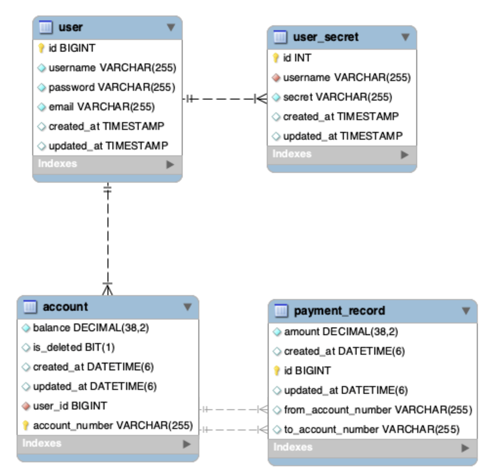
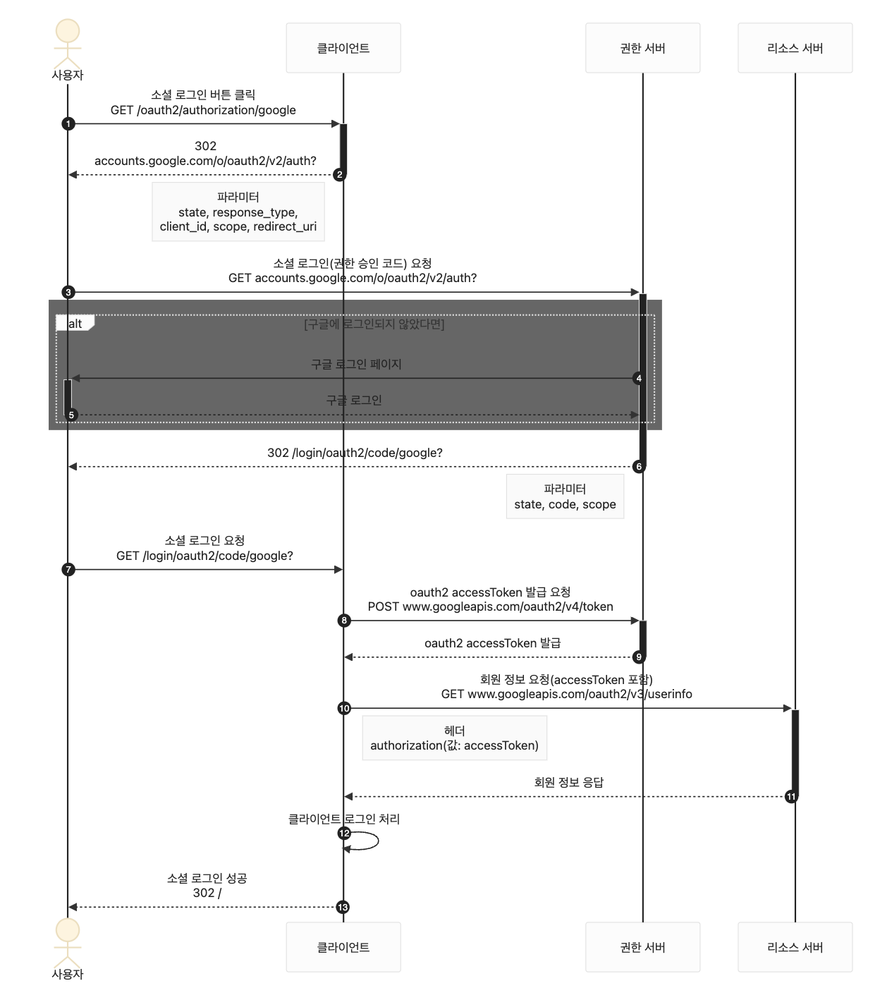
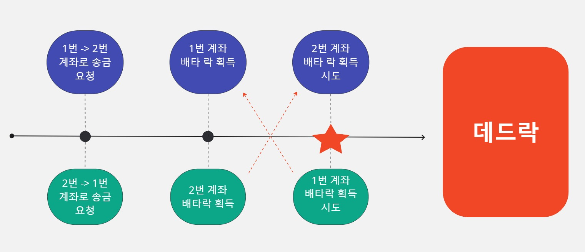
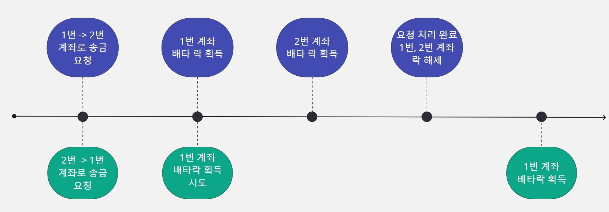
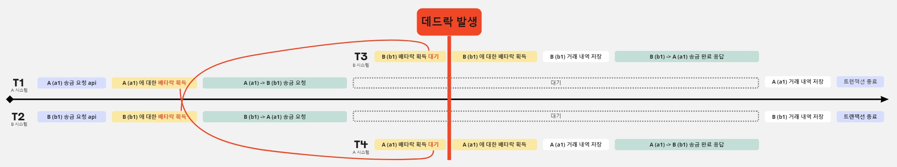
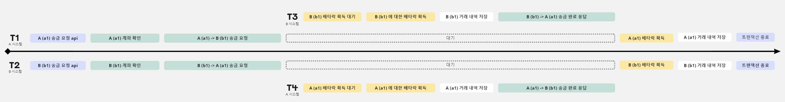
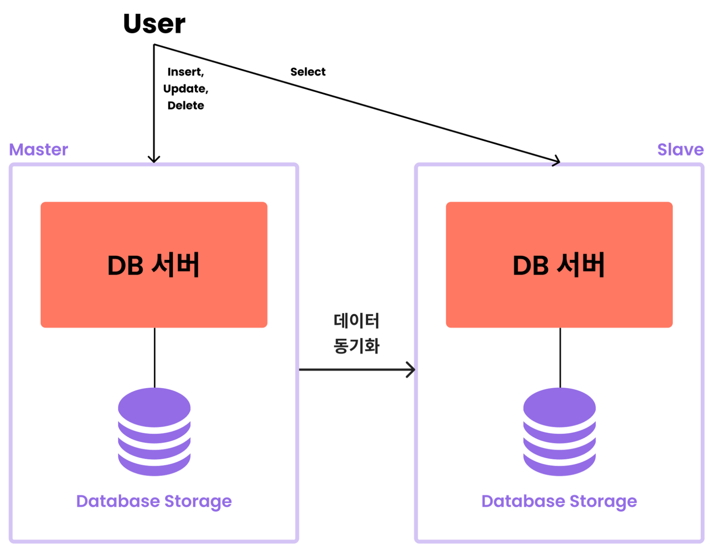

# 1. Introduction

## Team

- 서울 19반 변재호
- 서울 19반 박민지

## Skill & Tool

- java
- springboot
- jpa
- mysql (with replication)
- GCP (Google Cloud Platform)
- AWS EC2
- kafka
- k6

## Structure

- DB Schema
  
- Architecture Diagram
  

## Settings

- resources/privacy.yml 추가

  ```yml
  db:
    host: [host정보]
    port: 3306
    database: [db 이름]
    username: [user 이름]
    password: [비밀번호]

  master:
    host: [host정보]
    port: 3306
    database: [db 이름]
    username: [user 이름]
    password: [비밀번호]

  slave:
    host: [host정보]
    port: 3306
    database: [db 이름]
    username: [user 이름]
    password: [비밀번호]

  image:
    upload-locations: classpath:/static/images/
  ```

---

# 2. Project

## 목적

안전한 결제 시스템을 구현하기 위해 다음과 같은 요구사항들을 해결한다.

1. 단일 서버에서 동시성 문제를 해결한다.
2. 분산 서버에서 동시성 문제를 해결한다.
3. 성능과 고가용성을 위해 Read/Write로 분리된 데이터베이스를 구축한다.

- OAuth 기반 인증 방식을 알아보고 구현한다.

## 구현 기능

1. 입금 : 사용자는 돈을 입금할 수 있다.
2. 출금 : 사용자는 돈을 출금할 수 있다.
    - 사용자가 출금하려는 돈이 계좌에 없으면, '잔액부족'이 뜬다.
3. 송금 : 사용자는 현 계좌에서 다른 계좌로 돈을 송금할 수 있다.
    - 사용자가 송금하려는 돈이 계좌에 없으면, '잔액부족'이 뜬다.
    - 사용자는 같은 결제 시스템을 사용하는 계좌로 송금할 수 있다.
    - 사용자는 다른 결제 시스템을 사용하는 계좌로 송금할 수 있다.
4. OAuth 로그인 : 구글 소셜 로그인을 통해 회원가입 및 로그인을 할 수 있다.

### OAuth



1. 사용자가 소셜 로그인 버튼을 클릭한다.
2. 클라이언트가 사용자에 302 accounts.google.com/o/oauth2/v2/auth Response를 보낸다.
3. 사용자가 권한 승인 코드 발급 요청을 보낸다.
    - 파라미터 : state, response_type, client_id, scope, redirect_url
4. ~5)
5. 사용자가 구글에 로그인되어있지 않다면, 구글에 로그인한다.
6. 사용자가 구글 로그인에 성공하면, 권한 승인 코드(`code`)를 발급하고 302 response를 보낸다.
    - redirect url의 파라미터에 `code`가 추가되어 있음
7. 사용자가 클라이언트에 소셜 로그인을 요청한다.
    - 파라미터 : state, code, scope
8. ~9)
9. 클라이언트는 권한 서버에 `accessToken` 발급을 요청하고 응답 받는다.
10. ~11)
11. 클라이언트는 리소스 서버에 `accessToken`을 사용해 사용자의 정보를 요청하고 응답 받는다.
12. 클라이언트는 사용자 정보를 기반으로 회원가입/로그인을 처리한다.
    - `CustomOAuth2UserService.loadUser()`로 최초 로그인 시에는 회원가입으로, 아닐 시에는 로그인으로 처리
13. 클라이언트는 사용자에게 인증 관련 토큰/세션을 발급하며 로그인 성공 url redirect response를 보낸다.
    - `onAuthenticationSuccess()`로 사용자의 JWT 토큰을 발급하고, 로그인 성공 시 리다이렉트 url로 redirect한다.

## 구현 비기능

### 1. 단일 서버에서 트랜잭션 처리

> 단일 서버 내에서 한 계좌에서의 입금, 출금, 송금 요청이 동시다발적으로 들어올 때,<br>
> 트랜잭션의 원자성이 보장되어야 한다.<br>
> => 낙관적 락 vs 비관적 락 중 <b>비관적 락</b>을 선택함

#### 문제 발생

송금 요청 시, 데드락이 발생

#### 문제 발생 원인



#### 해결

배타락을 획득하는 순서를 일정하게 관리 => 계좌 번호가 작은 순부터 락을 획득하도록 하여 순환 대기 발생하지 않도록 코드 수정

- 기존 코드

  ```java
  // 계좌 송금
  @Transactional
  public void transfer(Long fromAccountId, Long toAccountId, BigDecimal amount) {
      Account fromAccount = accountRepository.findById(fromAccountId)
              .orElseThrow(() -> new RuntimeException("From account not found"));
      Account toAccount = accountRepository.findById(toAccountId)
              .orElseThrow(() -> new RuntimeException("To account not found"));

      if (fromAccount.isLess(amount)) {
          throw new RuntimeException("잔액 부족");
      }

      ...
  }
  ```

- 수정된 코드

  ```java
  // 계좌 송금
  @Transactional
  public void transfer(Long fromAccountId, Long toAccountId, BigDecimal amount) {
      Account fromAccount;
      Account toAccount;
      // 계좌 번호가 작은 순으로 락을 획득하도록 변경
      if (fromAccountId < toAccountId) {
      fromAccount = accountRepository.findById(fromAccountId)
      .orElseThrow(() -> new RuntimeException("From account not found"));
      toAccount = accountRepository.findById(toAccountId)
      .orElseThrow(() -> new RuntimeException("To account not found"));
      } else {
      toAccount = accountRepository.findById(toAccountId)
      .orElseThrow(() -> new RuntimeException("To account not found"));
      fromAccount = accountRepository.findById(fromAccountId)
      .orElseThrow(() -> new RuntimeException("From account not found"));
      }

      ...
  }
  ```

  

### 2. 분산 서버에서 트랜잭션 처리 1

> 분산 서버(서로 다른 결제 시스템) 사이에서 한 계좌에서 다른 계좌로의 송금 요청이 동시다발적으로 들어올 때,<br>
> 트랜잭션의 원자성이 보장되어야 한다.

#### 문제 발생

A시스템의 a1 계좌와 B시스템의 b1 계좌 사이에 송금하는 요청이 동시에 들어오면 데드락 발생

#### 문제 발생 원인



#### 해결

마찬가지로 배타락을 획득하는 순서를 뒤바꾸어, 획득 순서가 꼬이지 않도록 코드 수정

- 기존 코드

  ```java
  private void processWithOuterSystem(String fromAccountNumber, String toAccountNumber, BigDecimal amount) {
      // 1. 자기 계좌에 배타락을 획득한 상태
      Account fromAccount = accountWriteRepository.findByAccountNumberForUpdate(fromAccountNumber)
              .orElseThrow(() -> new BadRequestException("From account not found"));

      fromAccount.substractBalance(amount);
      PaymentRecord paymentRecord = new PaymentRecord(fromAccount.getAccountNumber(), amount.negate());
      paymentRecordWriteRepository.save(paymentRecord);

      // 2. 상대 계좌에서 배타락을 또 획득한 상태 => 데드락
      paymentClient.requestTransfer(fromAccountNumber, toAccountNumber, amount);
  }

  ```

- 수정된 코드

  ```java
  private void processWithOuterSystem(String fromAccountNumber, String toAccountNumber, BigDecimal amount) {
  // 1. 해당 계좌번호가 존재하는지만 확인
  if (!accountRepository.existsByAccountNumber(fromAccountNumber)) {
  throw new BadRequestException("From account not found");
  }

  // 2. 상대 계좌부터 락을 획득하여 처리하도록 변경
  paymentClient.requestTransfer(fromAccountNumber, toAccountNumber, amount);

  // 3. 이후 자기 계좌의 락을 획득하여 처리
  PaymentRecord paymentRecord = new PaymentRecord(fromAccountNumber, toAccountNumber, amount.negate());
  Account fromAccount = accountRepository.findByAccountNumberForUpdate(fromAccountNumber)
          .orElseThrow(() -> new BadRequestException("From account not found"));
  fromAccount.substractBalance(amount);
  paymentRecordRepository.save(paymentRecord);
  }
  ```



### 3.분산 서버에서 트랜잭션 처리 2

> 분산 서버(서로 다른 결제 시스템) 사이에서 한 계좌에서 다른 계좌로의 송금 장애나 예외처리로 인해 실패할 경우,<br>
> 트랜잭션이 rollback 되어야 한다.

### 4. Read/Write DB 분리 (DB Replication)

> 하나의 DB에서 모든 read,write를 처리하기보다,<br>
> read와 write를 처리하는 db를 분리하여 성능과 가용성을 높인다.



#### 성능 테스트

---

# 프로젝트 소감

### 변재호

```

```

### 박민지

```

```
