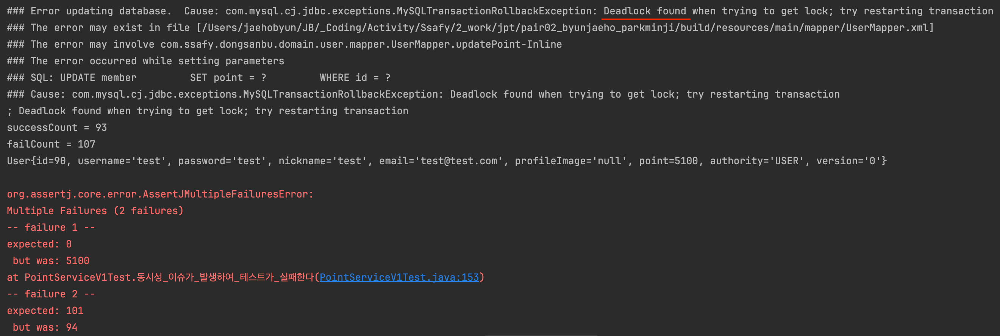
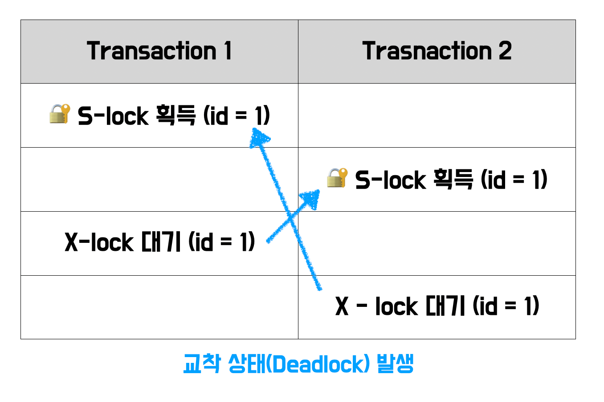
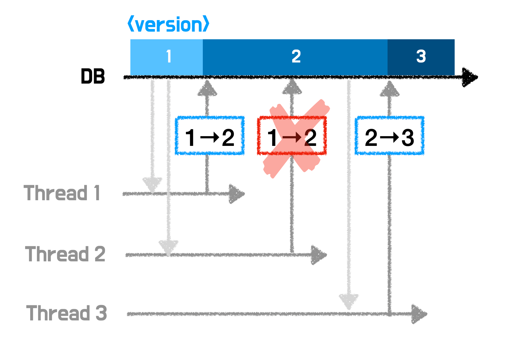

# 1. Introduction
## Team
- 서울 19반 변재호
- 서울 19반 박민지

## Skill & Tool
- java
- springboot
- jpa
- mysql (with replication)
- GCP (Google Cloud Platform)
- AWS EC2
- kafka
- k6

## Structure
- DB Schema
  
- Architecture Diagram
  

## Settings
- resources/privacy.yml 추가
  ```yml
  db:
    host: [host정보]
    port: 3306
    database: [db 이름]
    username: [user 이름]
    password: [비밀번호]

  master:
    host: [host정보]
    port: 3306
    database: [db 이름]
    username: [user 이름]
    password: [비밀번호]

  slave:
    host: [host정보]
    port: 3306
    database: [db 이름]
    username: [user 이름]
    password: [비밀번호]

  image:
    upload-locations: classpath:/static/images/
  ```

---
# 2. Project
## 목적
안전한 결제 시스템을 구현하기 위해 다음과 같은 요구사항들을 해결한다.
1. 단일 서버에서 동시성 문제를 해결한다.
2. 분산 서버에서 동시성 문제를 해결한다.
3. 성능과 고가용성을 위해 Read/Write로 분리된 데이터베이스를 구축한다.

- OAuth 기반 인증 방식을 알아보고 구현한다.

## 구현 기능
1. 입금 : 사용자는 돈을 입금할 수 있다.
2. 출금 : 사용자는 돈을 출금할 수 있다.
   - 사용자가 출금하려는 돈이 계좌에 없으면, '잔액부족'이 뜬다.
3. 송금 : 사용자는 현 계좌에서 다른 계좌로 돈을 송금할 수 있다.
   - 사용자가 송금하려는 돈이 계좌에 없으면, '잔액부족'이 뜬다.
   - 사용자는 같은 결제 시스템을 사용하는 계좌로 송금할 수 있다.
   - 사용자는 다른 결제 시스템을 사용하는 계좌로 송금할 수 있다.

## 구현 비기능

### 1. 단일 서버에서 트랜잭션 처리
> 단일 서버 내에서 한 계좌에서의 입금, 출금, 송금 요청이 동시다발적으로 들어올 때,<br>
> 트랜잭션의 원자성이 보장되어야 한다.<br>
> => 낙관적 락 vs 비관적 락 중 <b>비관적 락</b>을 선택함
#### 문제 발생
송금 요청 시, 데드락이 발생

#### 문제 발생 원인

#### 해결
배타락을 획득하는 순서를 일정하게 관리 => 계좌 번호가 사전 순으로 작은 순부터 락을 획득하도록 하여 순환 대기 발생하지 않도록 코드 수정


### 2. 분산 서버에서 트랜잭션 처리
> 분산 서버(서로 다른 결제 시스템) 사이에서 한 계좌에서 다른 계좌로의 송금 요청이 동시다발적으로 들어올 때,<br>
> 트랜잭션의 원자성이 보장되어야 한다.<br>
> 또한, 중간에 장애나 예외처리로 인해 트랜잭션이 실패하면, rollback 되어야 한다.
#### 문제 발생1
A시스템의 a1 계좌와 B시스템의 b1 계좌 사이에 송금하는 요청이 동시에 들어오면 데드락 발생

#### 문제 발생 원인


#### 해결
마찬가지로 배타락을 획득하는 순서를 뒤바꾸어, 획득 순서가 꼬이지 않도록 코드 수정


#### 1. 동시성 문제
> 일단 동시성 문제를 고의로 만들어보자
- PointServiceV1.java
    ```java
    @Service
    @RequiredArgsConstructor
    @Transactional(readOnly = true)
    public class PointServiceV1 {
        private final UserMapper userMapper;
        private final PointMapper pointMapper;
    
        @Transactional
        public void usePoint(int userId, int pointAmount) {
            User user = userMapper.findById(userId);
            if (user == null) {
                throw new RuntimeException("User not found");
            }
    
            pointMapper.insertPoint(new PointInsertDto(userId, -pointAmount));
    
            user.usePoint(pointAmount);
            userMapper.updatePoint(user);
        }
    }
    ```
- PointServiceV1Test.java
    ```java
    @DisplayNameGeneration(ReplaceUnderscores.class)
    @SpringBootTest
    @AutoConfigureTestDatabase(replace = AutoConfigureTestDatabase.Replace.NONE)
    @DisplayName("포인트 사용 시 동시성 이슈 발생 테스트")
    class PointServiceV1Test {
    private final PointServiceV1 pointServiceV1;
    private final UserMapper userMapper;
    private final AuthMapper authMapper;
    private final PointMapper pointMapper;

    @Autowired
    public PointServiceV1Test(PointServiceV1 pointServiceV1,
                              UserMapper userMapper,
                              AuthMapper authMapper,
                              PointMapper pointMapper) {
        this.pointServiceV1 = pointServiceV1;
        this.userMapper = userMapper;
        this.authMapper = authMapper;
        this.pointMapper = pointMapper;
    }

    @Value("${db.database}")
    private String database;
    @Value("${db.username}")
    private String username;
    @Value("${db.password}")
    private String password;

    @BeforeEach
    void setUp() {
        DBUtils.truncate("point_record", database, username, password);
        DBUtils.truncate("member", database, username, password);
    }

    @Test
    void 동시성_이슈가_발생하여_테스트가_실패한다() throws InterruptedException {
        // given
        int point = 10000;
        User user = User.builder()
                .username("test")
                .password("test")
                .nickname("test")
                .email("test@test.com")
                .authority("USER")
                .point(point)
                .build();
        userMapper.registUser(user);
        User savedUser = authMapper.findByUsernameAndPassword(new LoginDto("test", "test"));

        PointInsertDto pointInsertDto = new PointInsertDto(savedUser.getId(), point);
        pointMapper.insertPoint(pointInsertDto);
        // when
        int cnt = 200;
        int usePoint = 100;
        ExecutorService executorService = Executors.newFixedThreadPool(10);
        CountDownLatch countDownLatch = new CountDownLatch(cnt);
        AtomicInteger successCount = new AtomicInteger();
        AtomicInteger failCount = new AtomicInteger();

        for (int i = 0; i < cnt; ++i) {
            executorService.submit(() -> {
                try {
                    pointServiceV1.usePoint(savedUser.getId(), usePoint);
                    successCount.incrementAndGet();
                } catch (Exception e) {
                    System.out.println(e.getMessage());
                    failCount.incrementAndGet();
                } finally {
                    countDownLatch.countDown();
                }
            });
        }
        countDownLatch.await();
        System.out.println("successCount = " + successCount);
        System.out.println("failCount = " + failCount);

        //then
        User resultUser = userMapper.findById(savedUser.getId());
        System.out.println(resultUser);
        int pointRecordCount = DBUtils.countAll("point_record", database, username, password);

        SoftAssertions softly = new SoftAssertions();
        softly.assertThat(resultUser.getPoint()).isZero();
        softly.assertThat(pointRecordCount).isEqualTo(point / usePoint + 1);
        softly.assertAll();
        }
    }
    ```
- Test Result
  
    - 데드락 발생

#### Why?
- MySql은 FK를 가지는 테이블의 삽입,수정,삭제가 일어날 때, 해당 제약 조건을 위반하는지 확인하기 위해 관련 레코드들에 공유 잠금 (S lock)을 설정한다.
    - S Lock : 다른 트랜잭션의 데이터 '변경'을 막음.
    - 여러 트랜잭션이 동시에 S Lock 을 얻을 수 있음.
- 여러 트랜잭션이 S Lock을 얻고 있을 때, 서로의 배타 잠금 (X Lock)을 얻을 수 없는 상태가 되어 데드락 발생
    - X Lock : 한번에 하나의 트랜잭션만이 '쓰기' 작업을 수행할 수 있음.
- 정리하자면, 하나의 트랜잭션에서 일어나는 일은
    1. Member 테이블에 m.id 확인
    2. Point_Record 테이블에 새로운 행(포인트 변동 정보) 추가 -> `S Lock 획득`
    3. Member 테이블에 point 갱신 -> `X Lock` 대기 <br>
       => 다른 트랜잭션에서 설정한 S Lock 때문에 데드락 발생
       

#### 2. 동시성 문제를 어떻게 해결하지? Part 1
> 낙관적 락 (Optimistic Lock)
> > 여러 트랜잭션 간 충돌이 일어나지 않을 것이라 가정
> > - Version을 통한 관리
- 우선 연관관계를 없애자 (Point_Record2 테이블 사용)
- Member 테이블에 `version` 컬럼 추가
- 기존 userMapper.updatePoint()를 updatePointWithVersion()으로 바꾼다.
  ```xml
  <update id="updatePointWithVersion" parameterType="Map">
    UPDATE member
    SET point = #{point},
        version = #{originalVersion}+1
    WHERE id = #{id}
    AND version = #{originalVersion}
  </update> 
  ```
- 여러 트랜잭션에서 member의 데이터를 읽어왔을 때, version이 맞지 않으면 rollback 된다.
  
- 이렇게 rollback 된 데이터는 예외처리를 통해 재시도하는 로직을 구현해야 완전한 동시성 해결이 가능하다.
    - 재시도 방법 : retry 하는 AOP 구현
    - OptimisticLockRetryAspect.java
      ```java
      @Order(Ordered.LOWEST_PRECEDENCE - 1)
      @Aspect
      @Component
      public class OptimisticLockRetryAspect {
      private static final int MAX_RETRIES = 20;
      private static final int RETRY_DELAY_MS = 100;
    
        @Pointcut("@annotation(Retry)")
        public void retry() {
        }
    
        @Around("retry()")
        public Object retryOptimisticLock(ProceedingJoinPoint joinPoint) throws Throwable {
            Exception exceptionHolder = null;
            for (int attempt = 0; attempt < MAX_RETRIES; attempt++) {
                try {
                    return joinPoint.proceed();
                } catch (IllegalStateException e) {
                    exceptionHolder = e;
                    Thread.sleep(RETRY_DELAY_MS);
                }
            }
            throw exceptionHolder;
        }
      }
      ```
- Test Result

#### 3. 동시성 문제를 어떻게 해결하지? Part 2
> 비관적 락 (Pessimistic Lock)
> > 여러 트랜잭션 간 충돌이 일어날 것이라 가정
> > - Select ... For Update 문 => 특정 row에 배타 락 걸기
- 기존 userMapper.findById()를 findByIdForUpdate() 로 바꾼다.
  ```xml
  <select id="findByIdForUpdate" parameterType="int" resultType="user">
    SELECT *
    FROM member
    WHERE id = #{id}
    For Update
  </select>
  ```
- select for update 문으로 해당 row에 배타락이 걸리기 때문에, 다른 트랜잭션들은 이 락이 풀릴 때까지 대기해야 한다.
- Test Result
  

#### 낙관적 락 vs 비관적 락
- 낙관적 락
    - 동시성 문제를 db 레벨이 아닌, `어플리케이션 레벨`에서 처리 (version을 통해)
    - 따라서, 버전 충돌로 인해 실패할 경우, 직접 예외처리로 재시도 로직을 구현해야 함
    - 요청이 들어온 순서대로 X. 재시도 타이밍에 따라 O => 요청 순서대로 처리하는 상황에 부적합
- 비관적 락
    - 단일 DB 환경에만 적용 가능
    - 반드시 한 트랜잭션이 완료될 때까지 나머지가 대기해야하므로 대기시간이 오래 걸림 => 요청 수가 많아지면 대기시간이 길어짐

<br />

### JWT 인증

---

#### 사용자 로그인 및 로그아웃

```java
@Service
@RequiredArgsConstructor
public class AuthService {
    private final AuthMapper authMapper;
    private final UserMapper userMapper;
    private final LogoutTokenMapper logoutTokenMapper;
    private final JwtResolver jwtResolver;
    private final JwtProvider jwtProvider;

    public LoginResponse login(LoginRequest request) {
        User user = findUserByUsernameAndPassword(request);

        String accessToken = createAccessToken(user);
        String refreshToken = createRefreshToken(user);
        return new LoginResponse(refreshToken, accessToken);
    }

    private User findUserByUsernameAndPassword(LoginRequest request) {
        Ingredient ingredient = userMapper.findIngredientById(request.username());
        String encodedPassword = MyCrypt.byteArrayToHex(
                MyCrypt.getSHA256(request.password(), ingredient.getSalt()));

        LoginDto loginDto = new LoginDto(request.username(), encodedPassword);
        User user = authMapper.findByUsernameAndPassword(loginDto);
        if (user == null) {
            throw new BadRequestException("아이디 또는 비밀번호가 일치하지 않습니다.");
        }

        return user;
    }

    private String createAccessToken(User user) {
        LocalDateTime expiredTime = jwtProvider.calAccessTokenExpirationTime(LocalDateTime.now());
        return jwtProvider.createToken(user, expiredTime);
    }

    private String createRefreshToken(User user) {
        LocalDateTime expiredTime = jwtProvider.calRefreshTokenExpirationTime(LocalDateTime.now());
        return jwtProvider.createToken(user, expiredTime);
    }

    @Transactional
    public void logout(String accessToken) {
        String memberName = jwtResolver.getName(accessToken);

        logoutAccessToken(memberName, accessToken);
        logoutRefreshToken(memberName);
    }

    private void logoutAccessToken(String memberName, String accessToken) {
        long expiration = jwtResolver.getExpirationTime(accessToken);
        logoutTokenMapper.save(new AccessToken(memberName, accessToken), expiration);
    }

    private void logoutRefreshToken(String memberName) {
        logoutTokenMapper.delete(new RefreshToken(memberName));
    }
}
```

```java
package com.ssafy.dongsanbu.domain.auth.controller;

import com.ssafy.dongsanbu.domain.auth.dto.LoginRequest;
import com.ssafy.dongsanbu.domain.auth.dto.LoginResponse;
import com.ssafy.dongsanbu.domain.auth.service.AuthService;
import com.ssafy.dongsanbu.global.util.CookieUtil;
import com.ssafy.dongsanbu.infra.jwt.JwtProperties;
import jakarta.servlet.http.HttpServletRequest;
import jakarta.servlet.http.HttpServletResponse;
import lombok.RequiredArgsConstructor;
import org.springframework.web.bind.annotation.GetMapping;
import org.springframework.web.bind.annotation.PostMapping;
import org.springframework.web.bind.annotation.RequestBody;
import org.springframework.web.bind.annotation.RequestMapping;
import org.springframework.web.bind.annotation.RestController;

@RestController
@RequestMapping("/api/v1/auth")
@RequiredArgsConstructor
public class AuthController {
    private final JwtProperties jwtProperties;
    private final AuthService authService;

    @PostMapping("/login")
    public void login(@RequestBody LoginRequest request, HttpServletResponse response) {
        LoginResponse token = authService.login(request);
        CookieUtil.addCookie(response,
                jwtProperties.getAccessTokenCookieName(),
                token.accessToken(),
                jwtProperties.getAccessTokenDuration().getSeconds());
        CookieUtil.addCookie(response,
                jwtProperties.getRefreshTokenCookieName(),
                token.refreshToken(),
                jwtProperties.getRefreshTokenDuration().getSeconds());
    }

    @GetMapping("/logout")
    public void logout(HttpServletRequest request, HttpServletResponse response) {
        String accessToken = CookieUtil.getCookieValue(request, jwtProperties.getAccessTokenCookieName())
                .orElseThrow(() -> new IllegalStateException("쿠키에서 access token을 가져올 수 없습니다."));
        authService.logout(accessToken);

        CookieUtil.deleteCookie(request, response, jwtProperties.getAccessTokenCookieName());
        CookieUtil.deleteCookie(request, response, jwtProperties.getRefreshTokenCookieName());
    }
}
```
로그인
- 사용자의 아이디와 비밀번호 기반으로 사용자 정보를 가져온다.
- 만약 잘못된 아이디와 비밀번호라면 400을 응답한다.
- 사용자의 이름에 기반하여 access token과 refresh token을 만든다.
    - refresh token은 유효기간이 기므로, 발급 후 db에 저장하여 서버에서 만료 가능하도록 한다.
- 토큰을 httponly로 쿠키에 저장하여 응답한다.

로그아웃
- refresh token과 access token을 로그아웃 db에 저장한다.
- refresh token, access token 쿠키를 삭제한다.

<br />

#### JWT 기반 사용자 인증

```java
@RequiredArgsConstructor
@Slf4j
@Component
public class JwtAuthenticationFilter extends OncePerRequestFilter {
    private final JwtProvider jwtProvider;
    private final JwtResolver jwtResolver;
    private final JwtProperties jwtProperties;

    private static void handleUnsuccess(String requestUri, HttpServletResponse response) {
        log.debug("No valid token: {}", requestUri);
        response.setStatus(HttpServletResponse.SC_UNAUTHORIZED);
    }

    @Override
    protected void doFilterInternal(@NonNull HttpServletRequest request,
                                    @NonNull HttpServletResponse response,
                                    @NonNull FilterChain filterChain) throws ServletException, IOException {
        if (isLoginOrSignupRequest(request)) {
            filterChain.doFilter(request, response);
            return;
        }

        String accessToken = resolveAccessToken(request);
        String refreshToken = resolveRefreshToken(request);
        String requestUri = request.getRequestURI();

        if (verify(accessToken)) {
            handleSuccess(accessToken, requestUri);
        } else if (verify(refreshToken)) {
            createNewAccessTokenAndHandleSuccess(response, refreshToken);
        } else {
            handleUnsuccess(requestUri, response);
            return;
        }

        filterChain.doFilter(request, response);
    }

    private boolean isLoginOrSignupRequest(HttpServletRequest request) {
        String requestURI = request.getRequestURI();
        return requestURI.equals("/api/v1/auth/login");
    }

    private String resolveAccessToken(HttpServletRequest request) {
        return CookieUtil.getCookieValue(request, jwtProperties.getAccessTokenCookieName())
                .orElse(null);
    }

    private String resolveRefreshToken(HttpServletRequest request) {
        return CookieUtil.getCookieValue(request, jwtProperties.getRefreshTokenCookieName())
                .orElse(null);
    }

    private boolean verify(String token) {
        return StringUtils.hasText(token)
                && jwtProvider.isValidToken(token);
    }

    private void handleSuccess(String token, String requestUri) {
        User user = jwtResolver.getUser(token);
        log.debug("{} stored in context: {}", user.getUsername(), requestUri);
    }

    private void createNewAccessTokenAndHandleSuccess(
            HttpServletResponse response, String refreshToken) {
        User user = jwtResolver.getUser(refreshToken);
        LocalDateTime expiredTime = jwtProvider.calAccessTokenExpirationTime(LocalDateTime.now());
        String accessToken = jwtProvider.createToken(user, expiredTime);

        CookieUtil.addCookie(response, jwtProperties.getAccessTokenCookieName(), accessToken,
                jwtProperties.getAccessTokenDuration().getSeconds());
    }
}

```
사용자 인증이 필요한 모든 api에 대해 적용한다.

로직
1. 요청에서 access token과 refresh token을 파싱한다.
2. access token 유효성을 검사한다.
- 토큰이 유효하고, 만료되지 않았고, 로그아웃 db에도 없다면 인증이 성공한다.
3. 토큰이 만료되었다면, 유효한 refresh token인 경우 새 access token을 발급하여 쿠키에 설정한다.
4. 이외의 경우는 401을 응답한다.

참고) 로그아웃 처리는 코드에 구현하지 않았습니다.

---
# 프로젝트 소감
### 박민지
```
트랜잭션 처리를 코드로 공부해보며 트랜잭션을 안전하게 처리하기 위해 
동시성 이슈 방지, 데드락, 커넥션 타임아웃으로 인한 요청 실패에 대한 보상 로직을 구현해야 한다는 점을 배웠습니다.
이외에도 다른 트랜잭션을 안전하게 사용할 수 없는 단일 DB가 아닌 멀티 DB 사용, 복제, 장애 상황 등에 대한 
해결 방안을 알아나가며 공부하는 방식으로, 추상적이었던 안전한 트랜잭션 처리를 어떻게 공부해야 하는지 배웠습니다.
```

### 변재호
```
항상 이론으로만 공부하던 트랜잭션 처리를 직접해볼 수 있어서 좋았습니다.
트랜잭션을 처리하는 방법으로 이외에도 메시지큐, 분산잠금 등이 있다는데 이후에 이 부분도 다루어볼 수 있다면 좋을 것 같습니다.
```
